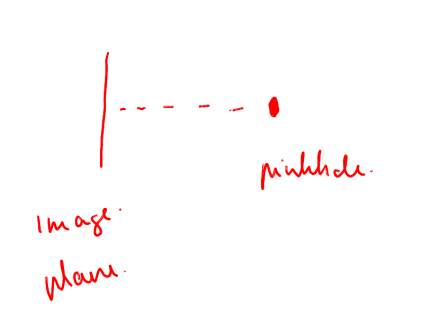

# Perspective Projection, Intrinsics, and Depth

This is **Part 4** of a 4-part series:

1. [Understanding Camera Coordinate Transformations](1_camera_transformation.md)
2. [Orthographic Projection? 📸](2_orthographic_projection.md)
3. [Viewport Transform for Orthographic LiDAR Projection](3_viewport_transform.md)
4. [Perspective Projection, Intrinsics, and Depth](4_perspective_intrinsics_and_depth.md)

---

# Table of Contents

- [Perspective Projection, Intrinsics, and Depth](#perspective-projection-intrinsics-and-depth)
- [Table of Contents](#table-of-contents)
- [Glossary](#glossary)
- [Intro](#intro)
- [1. The Intrinsic Matrix](#1-the-intrinsic-matrix)
- [2. Principal Point: `cx`, `cy`](#2-principal-point-cx-cy)
- [3. Focal Length in Pixels: `fx`, `fy`](#3-focal-length-in-pixels-fx-fy)
  - [What focal length really does](#what-focal-length-really-does)
- [4. Pixel to Ray](#4-pixel-to-ray)
  - [First let's talk about the virtual image plane](#first-lets-talk-about-the-virtual-image-plane)
  - [Pixel to Ray](#pixel-to-ray)
  - [Calculating the angle for a given ray](#calculating-the-angle-for-a-given-ray)
- [5. Where Depth Enters](#5-where-depth-enters)
- [6. Pixel Physical Size Calculation](#6-pixel-physical-size-calculation)
- [7. Angular Size Plus Depth Becomes Meters](#7-angular-size-plus-depth-becomes-meters)
- [8. How Depth-Corrected Area Is Computed](#8-how-depth-corrected-area-is-computed)
- [9. The Short Version](#9-the-short-version)
- [References](#references)

---


# Glossary

- **Pinhole (Camera Center)**: The theoretical single point where all incoming light rays intersect before hitting the image sensor.
- **Virtual Image Plane**: A mathematical construct placed *in front* of the camera center. It represents the image correctly oriented (upright), rather than working with the physically upside-down image on the real sensor.
- **Intrinsic Matrix**: A matrix mapping 2D pixel coordinates to 3D viewing rays, containing the focal length and principal point.
- **Principal Point ($c_x, c_y$)**: The physical "center of vision" on the sensor; the exact pixel where the camera looks directly straight ahead.
- **Focal Length ($f_x, f_y$)**: The distance from the pinhole to the virtual image plane, measured in pixel units, which dictates the field of view.
- **Depth Map**: An array of values matching the image resolution where each pixel encodes the physical distance from the camera to the visible surface.

# Intro

In the orthographic projection posts, the useful simplification was this:

> A pixel can be treated as a constant-sized square in the real world.

That is why orthographic projection is easier for measurement. Once we know the scale, pixel distance can be converted back into real distance with simple multiplication.

Perspective projection breaks this assumption.

In perspective projection, a pixel is not a fixed-size square in the world. A pixel is more like a small direction coming out of the camera. Close to the camera, that direction covers a small physical area. Far away, the same direction covers a larger physical area. This is exactly how regular photography works. 

Parallel train tracks    


This is also how our eyesight works. In real world its not possible to directly obtain ortographic projection.

This is why an RGB-D measurement pipeline becomes important in real world. It combines 

1. image taken with perspective projection using camera intrinsics
2. depth data (this can be from lidar, photogrammetry ...)


In essence
- The intrinsics tell us where a pixel is looking.
- The depth tells us how far away the object is at that pixel.

Together they let us estimate how large that pixel is in meters.

---

# 1. The Intrinsic Matrix

The camera intrinsic matrix usually looks like this:

$$
K =
\begin{pmatrix}
f_x & 0 & c_x \\
0 & f_y & c_y \\
0 & 0 & 1
\end{pmatrix}
$$

For example, a calibrated camera might have this intrinsic matrix:

```python
m = np.array([
    [3003.1174, 0, 2011.17],
    [0, 3003.1174, 1514.9209],
    [0, 0, 1]
])
```

So:

```text
fx = 3003.1174
fy = 3003.1174
cx = 2011.17
cy = 1514.9209
```

Definitions:

- `fx`: focal length **in pixels** in the horizontal direction.
- `fy`: focal length **in pixels** in the vertical direction.
- `cx`: x-coordinate of the principal point, in pixels.
- `cy`: y-coordinate of the principal point, in pixels.

These four values define how image pixels relate to camera rays.

---

# 2. Principal Point: `cx`, `cy`

The principal point is:

> The pixel where the camera is looking straight ahead.

It is located on the sensor.
It is not exactly the same thing as the image center, although it is usually close.

The image center is just the geometric middle of the rectangular image:

```text
image center = (image_width / 2, image_height / 2)
```

The principal point is physical:

```text
principal point = where the lens optical axis hits the sensor
```

In a perfect camera, those would be exactly the same. In a real camera, the lens and sensor are not mounted with mathematical perfection, so calibration gives us the actual principal point.

For example, if an image is roughly `4032 x 3024`, then the image center is:

```text
(2016, 1512)
```

This example principal point is:

```text
(2011.17, 1514.9209)
```

That is very close to the center, but not exactly. It is about 4.8 pixels left and 2.9 pixels down from the image center.

The useful mental model is:

```text
(cx, cy) = the zero point for camera direction
```

If a pixel is exactly at `(cx, cy)`, then it looks straight forward from the camera.

If a pixel is to the right of `cx`, then it looks a bit to the right.

If a pixel is to the left of `cx`, then it looks a bit to the left.

Same for `cy` vertically.

This is why the code uses:

```python
x - cx
y - cy
```

It is asking:

```text
How far is this pixel from the straight-ahead pixel?
```

---

# 3. Focal Length in Pixels: `fx`, `fy`

The values `fx` and `fy` are focal lengths, but measured in pixels.

That sounds strange at first because focal length is often described in millimeters. But for image geometry, pixel units are more practical.

In the ideal pinhole camera model, focal length means the forward distance from the pinhole to the image plane.




## What focal length really does

- `fx` is the horizontal version. It tells us how much moving left or right in the image changes the left-right viewing angle.
- `fy` is the vertical version. It tells us how much moving up or down in the image changes the up-down viewing angle.

Large `fx` means:

```text
same pixel offset = smaller angle
```

That is like a zoomed-in / narrow field-of-view camera.

Small `fx` means:

```text
same pixel offset = larger angle
```

That is like a wide-angle camera.

The same applies to `fy`, but vertically.

In this example, `fx` and `fy` are equal:

```text
fx = fy = 3003.1174
```

That means this example assumes the camera has the same scaling horizontally and vertically. In practical terms, square pixels and symmetric focal scaling. This is commonly assumed.

---

# 4. Pixel to Ray

## First let's talk about the virtual image plane

In the pinhole camera model, the real image sensor sits behind the small camera hole / camera center.

That real image plane receives an upside-down version of the world, because light rays cross at the pinhole before they hit the sensor.

For geometry, that flipped picture is annoying. So instead of drawing the image plane behind the pinhole, we usually draw a **virtual image plane** in front of the pinhole, between the camera and the scene.

It represents almost the same thing as the actual image plane, but inverted to the front side:

```text
scene
    |
    |
virtual image plane
    |
camera center / pinhole
    |
real image plane / sensor
```

The virtual image plane is not a physical surface inside the camera. It is a mathematical helper. It lets us say that a pixel is in front of the camera and that the ray goes from the camera center through that pixel into the world.

So the virtual image plane is basically the real image plane mirrored through the pinhole. Same projection idea, but with the inconvenient upside-down sensor image turned into a forward-facing construction.

## Pixel to Ray

In practical terms, a ray is built like this

```python
ray_center = np.array([x - cx, y - cy, fx])
```

"ray_center" means the point on the virtual image plane that the ray passes through, measured relative to the pinhole/camera center.


The components mean:

```text
x - cx = horizontal offset from straight ahead
y - cy = vertical offset from straight ahead
fx     = forward direction / focal length in pixel units
```

If the pixel is at the principal point:

```text
x = cx
y = cy
```

then:

```python
ray_center = [0, 0, fx]
```

That ray points straight forward.

If the pixel is 100 pixels to the right:

```text
x = cx + 100
y = cy
```

then:

```python
ray_center = [100, 0, fx]
```

That ray points forward and slightly right.

So the intrinsic matrix lets us turn a pixel coordinate into a camera ray.

This is the first half of the perspective-measurement trick.


Those coordinates do not say where the object is in 3D. They say which direction the camera is looking for that pixel.


After normalization:

```text
d = normalize([x - cx, y - cy, f])
```

we get a unit ray direction `d` from the camera center.

So one RGB pixel really means:

```text
the object is somewhere along this ray
```

not:

```text
the object is exactly here
```

A normal RGB image gives color at each pixel, but it does not give the depth of the visible surface. One pixel therefore corresponds to infinitely many possible 3D points along the same ray:

```text
pinhole  ---------------------------->
                                 many possible depths
```

## Calculating the angle for a given ray

Once we have a ray, we often want its **angle away from straight ahead**. This is useful because it tells us how far off-axis the camera is looking for a given pixel.

The ray is built from two pieces of information:

```text
pixel offset = how far the pixel is from the principal point
focal length = forward distance to the virtual image plane
```

These two form a right triangle:

- the **opposite** side is the pixel offset (`x - cx` horizontally, or `y - cy` vertically),
- the **adjacent** side is the focal length (`fx` or `fy`).

The tangent of the ray angle is then simply the offset divided by the focal length:

$$
\tan(\theta_x) = \frac{x - c_x}{f_x}
\qquad
\tan(\theta_y) = \frac{y - c_y}{f_y}
$$

Taking the inverse tangent gives the angle itself:

$$
\theta_x = \arctan\!\left(\frac{x - c_x}{f_x}\right)
\qquad
\theta_y = \arctan\!\left(\frac{y - c_y}{f_y}\right)
$$

In short:

```text
divide the pixel offset by the focal length -> tangent of the angle
apply arctan                                -> the ray angle (in radians)
```

Note: `arctan()` and always return angles in radians. A pixel at the principal point gives an offset of `0`, so the angle is `0` (straight ahead). The farther the pixel sits from the principal point, the larger the angle. All angles computed from intrinsics are in radians and can be used directly in `np.tan()`, `np.sin()`, etc.

---

# 5. Where Depth Enters

The depth data answers a different question:

```text
How far away is the visible surface at this pixel?
```

So for a pixel `(x, y)`, the depth map might say:

```text
depth = 2.0 meters
```

The intrinsic matrix gives the direction.

The depth map gives the distance.

Together:

```text
pixel + intrinsics -> ray direction
ray direction + depth -> real metric point / size
```

This is why LiDAR matters. In a normal RGB image, we see the pixel, but we do not directly know how far away the object is. With LiDAR/depth, we get that missing scalar.

If:

```text
C = camera center - Also known as the pinhole.
d = ray normalized
z = depth obtained
p = actual 3D point
```

then the reconstruction idea is:

```text
p = C + z d
```

This equation is the heart of RGB-D reconstruction, point clouds, SLAM, NeRF ray sampling, photogrammetry, and the LiDAR-to-RGB-to-segmentation-to-backprojection workflow.

The workflow is elegant because each space does what it is good at:

```text
2D RGB image space -> segmentation works well
3D LiDAR space     -> geometry and measurement work well
rays + depth       -> bridge between them
```

So the pipeline can project LiDAR into the RGB image, segment the object in 2D, and then backproject the selected pixels into 3D using the depth values.

---

# 6. Pixel Physical Size Calculation

For area measurement, we do not only need the 3D position of one pixel. We need area.

So the question becomes:

> At this depth, how much real-world width and height does one image pixel cover?

To estimate that pixel footprint, we compare the ray through one pixel with the rays through its immediate neighbors:

```python
ray_center = np.array([x - cx, y - cy, fx])
ray_right = np.array([x + 1 - cx, y - cy, fx])
ray_down = np.array([x - cx, y + 1 - cy, fy])
```

Then we can get the angular separation in two equivalent ways:

1. **Method A: angle between two 3D vectors (dot product)**

```text
ray_center vs ray_right
ray_center vs ray_down
```

Using the standard vector formula, the angle $\theta$ between two vectors $\mathbf{a}$ and $\mathbf{b}$ is:

$$
    \theta = \arccos\left(\frac{\mathbf{a} \cdot \mathbf{b}}{\|\mathbf{a}\| \|\mathbf{b}\|}\right)
$$

2. **Method B: subtract per-ray off-axis angles (from arctan)**

From earlier, let $\theta_x$ and $\theta_y$ denote the horizontal and vertical off-axis angles of a ray from the principal point:

$$
    \theta_x = \arctan\!\left(\frac{x-c_x}{f_x}\right),
\qquad
    \theta_y = \arctan\!\left(\frac{y-c_y}{f_y}\right)
$$

So the one-pixel angular step can also be written as:

$$
\Delta\theta_x = \left|\arctan\!\left(\frac{x+1-c_x}{f_x}\right) - \arctan\!\left(\frac{x-c_x}{f_x}\right)\right|
$$

$$
\Delta\theta_y = \left|\arctan\!\left(\frac{y+1-c_y}{f_y}\right) - \arctan\!\left(\frac{y-c_y}{f_y}\right)\right|
$$

Both methods describe the same local pixel angle; the dot-product form is general in 3D, while the arctan-difference form makes the center-offset intuition explicit.


- Close to the camera, the gap is small.

- Far from the camera, the gap is larger.

That is perspective.

---

# 7. Angular Size Plus Depth Becomes Meters

After the code has:

```text
angular_width_rad
angular_height_rad
depth
```

it computes:

```python
width_m = 2 * distance_m * np.tan(angular_width_rad / 2)
height_m = 2 * distance_m * np.tan(angular_height_rad / 2)
```

The formula comes from splitting the pixel's viewing angle into two equal halves. If the full angular width is `angular_width_rad`, then half of that angle reaches from the center ray to one side of the pixel footprint. At distance `distance_m`, the tangent of that half-angle gives half of the physical width:

```text
half_width = distance_m * tan(angular_width_rad / 2)
```

Multiplying by `2` gives the full pixel width in meters. The same logic applies vertically for `height_m`.

This converts angular pixel size into physical pixel size.

The intuition is:

```text
physical size grows with distance
```

So if a pixel has the same angular width, then:

```text
at 1 meter  -> small real-world width
at 5 meters -> larger real-world width
```

This is the exact point where intrinsics and depth are combined.

The intrinsics produce the angular size.

The depth scales that angular size into meters.

---

# 8. How Depth-Corrected Area Is Computed

The segmentation image tells the code which pixels belong to the object:

```python
if pix_segment[y][x] == (0, 0, 0):
```

For every black pixel, the code does:

1. read depth at that pixel,
2. use intrinsics to compute pixel angular width and height,
3. convert angular width and height into meters using depth,
4. add the small physical pixel area.

In simplified form:

```python
for each segmented pixel:
    d = depth_at(x, y)
    angular_width, angular_height = pixel_angular_size(x, y, K)
    width_m, height_m = pixel_physical_size(d, angular_width, angular_height)
    area += width_m * height_m
```

So the final area is not:

```text
number of pixels * one fixed area
```

It is:

```text
sum of many depth-corrected pixel areas
```

That is the practical difference between orthographic measurement and perspective measurement.

---

# 9. The Short Version

The intrinsic matrix tells us:

```text
where is straight ahead?
how much does a pixel offset change the viewing angle?
```

Depth tells us:

```text
how far away is the object at this pixel?
```

Together:

```text
intrinsics + depth = metric interpretation of an image pixel
```

In one sentence:

> The intrinsic matrix turns pixels into rays, and the depth map tells where those rays hit the object.

That is the core idea behind perspective area calculation with depth.

# References

- [Dissecting the Camera Matrix, Part 3: The Intrinsic Matrix](https://ksimek.github.io/2013/08/13/intrinsic/)
- [Focal Length and Intrinsic Camera Parameters](https://www.baeldung.com/cs/focal-length-intrinsic-camera-parameters)
- [Intrinsic and Extrinsic Parameters of Pinhole Camera](https://robotlabx.com/blog/2024-01-10-Intrinsic-and-extrinsic-parameters-of-pinhole-camera/)
