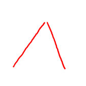
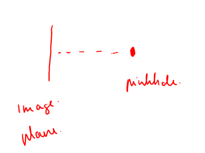
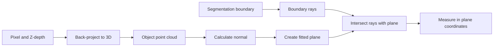

# Perspective Projection, Intrinsics, and Depth

This is **Part 4** of a 4-part series:

1. [Understanding Camera Coordinate Transformations](1_camera_transformation.md)
2. [Orthographic Projection? 📸](2_orthographic_projection.md)
3. [Viewport Transform for Orthographic LiDAR Projection](3_viewport_transform.md)
4. [Perspective Projection, Intrinsics, and Depth](4_perspective_intrinsics_and_depth.md)

---

# Table of Contents

- [Perspective Projection, Intrinsics, and Depth](#perspective-projection-intrinsics-and-depth)
- [Table of Contents](#table-of-contents)
- [Glossary](#glossary)
- [Assumptions](#assumptions)
- [Intro](#intro)
- [1. The Intrinsic Matrix](#1-the-intrinsic-matrix)
- [2. Principal Point: `cx`, `cy`](#2-principal-point-cx-cy)
- [3. Focal Length in Pixels: `fx`, `fy`](#3-focal-length-in-pixels-fx-fy)
  - [What focal length really does](#what-focal-length-really-does)
- [4. Pixel to Ray](#4-pixel-to-ray)
  - [First let's talk about the virtual image plane](#first-lets-talk-about-the-virtual-image-plane)
  - [Pixel to Ray](#pixel-to-ray)
- [5. Back-Projection into 3D](#5-back-projection-into-3d)
  - [Connecting the dots](#connecting-the-dots)
- [6. Creating a Point Cloud](#6-creating-a-point-cloud)
- [7. Calculating the Surface Normal and Plane](#7-calculating-the-surface-normal-and-plane)
  - [Calculate the center](#calculate-the-center)
  - [Calculate the normal](#calculate-the-normal)
  - [Create the plane](#create-the-plane)
- [8. Measuring on the Plane](#8-measuring-on-the-plane)
  - [Move the image boundary onto the plane](#move-the-image-boundary-onto-the-plane)
  - [Create a 2D coordinate system on the plane](#create-a-2d-coordinate-system-on-the-plane)
  - [Calculate length and area](#calculate-length-and-area)
- [9. The Short Version](#9-the-short-version)
- [Mermaid Diagrams](#mermaid-diagrams)
  - [Diagram 1](#diagram-1)
- [References](#references)

---


# Glossary

- **Pinhole (Camera Center)**: The theoretical single point where all incoming light rays intersect before hitting the image sensor.
- **Virtual Image Plane**: A mathematical construct placed *in front* of the camera center. It represents the image correctly oriented (upright), rather than working with the physically upside-down image on the real sensor.
- **Intrinsic Matrix**: A matrix that maps camera-space ray directions to image pixels. Its inverse maps pixels back to viewing rays.
- **Principal Point ($c_x, c_y$)**: The physical "center of vision" on the sensor; the exact pixel where the camera looks directly straight ahead.
- **Focal Length ($f_x, f_y$)**: The distance from the pinhole to the virtual image plane, measured in pixel units, which dictates the field of view.
- **Depth Map**: An array matching the image resolution where each pixel encodes the visible surface's depth. In this post, each value is Z-depth: the forward distance to the surface measured parallel to the camera's optical axis.
- **Back-Projection**: The operation that converts a pixel and its depth into a 3D point in camera coordinates.
- **Point Cloud**: A collection of reconstructed 3D points.
- **Surface Normal**: A unit vector perpendicular to a surface or fitted plane.
- **Plane Coordinates**: A 2D metric coordinate system attached to a 3D plane.

# Assumptions

- This post assumes that the depth map stores Z-depth, measured parallel to the camera's optical axis. It is not the Euclidean distance along the viewing ray, except at the principal point. See [Z-Depth vs Euclidean Depth in Perspective Projection](z_depth_vs_euclidean_depth.md) for a detailed comparison.
- The depth map is registered to the image, so pixel $(x,y)$ and depth $Z(x,y)$ describe the same camera ray.
- The plane-measurement method assumes that the measured surface is approximately planar. Curved surfaces require a mesh or local surface model.
- focal length "f" is given in pixel units

# Intro

In the orthographic projection posts, the useful simplification was this:

> A pixel can be treated as a constant-sized square in the real world.

That is why orthographic projection is easier for measurement. Once we know the scale, pixel distance can be converted back into real distance with simple multiplication.

Perspective projection breaks this assumption.

In perspective projection, a pixel is not a fixed-size square in the world. A pixel identifies a viewing ray leaving the camera. To recover metric geometry, we point that ray back into the 3D world and determine where it meets the visible surface.

Parallel train tracks    



This is also how our eyesight works. In real world its not possible to directly obtain ortographic projection.

This is why an RGB-D measurement pipeline becomes important in the real world. It combines 

1. image taken with perspective projection using camera intrinsics
2. a Z-depth map (this can be derived from LiDAR, photogrammetry, or another depth source)


In essence
- The intrinsics tell us where a pixel is looking.
- The Z-depth tells us how far forward the visible surface is at that pixel.

Together they let us reconstruct visible points in 3D. We can then estimate the surface plane and calculate physical dimensions in that plane.

---

# 1. The Intrinsic Matrix

The camera intrinsic matrix usually looks like this:

$$
K =
\begin{pmatrix}
f_x & 0 & c_x \\
0 & f_y & c_y \\
0 & 0 & 1
\end{pmatrix}
$$

For example, a calibrated camera might have this intrinsic matrix:

```python
m = np.array([
    [3003.1174, 0, 2011.17],
    [0, 3003.1174, 1514.9209],
    [0, 0, 1]
])
```

So:

```text
fx = 3003.1174
fy = 3003.1174
cx = 2011.17
cy = 1514.9209
```


Definitions:

- `fx`: focal length **in pixels** in the horizontal direction.
- `fy`: focal length **in pixels** in the vertical direction.
- `cx`: x-coordinate of the principal point, in pixels.
- `cy`: y-coordinate of the principal point, in pixels.

These four values define how image pixels relate to camera rays.

---

# 2. Principal Point: `cx`, `cy`

The principal point is:

> The pixel where the camera is looking straight ahead.

It is located on the sensor.
It is not exactly the same thing as the image center, although it is usually close.

The image center is just the geometric middle of the rectangular image:

```text
image center = (image_width / 2, image_height / 2)
```

The principal point is physical:

```text
principal point = where the lens optical axis hits the sensor
```

In a perfect camera, those would be exactly the same. In a real camera, the lens and sensor are not mounted with mathematical perfection, so calibration gives us the actual principal point.

For example, if an image is roughly `4032 x 3024`, then the image center is:

```text
(2016, 1512)
```

This example principal point is:

```text
(2011.17, 1514.9209)
```

That is very close to the center, but not exactly. It is about 4.8 pixels left and 2.9 pixels down from the image center.

The useful mental model is:

```text
(cx, cy) = the zero point for camera direction
```

If a pixel is exactly at `(cx, cy)`, then it looks straight forward from the camera.

If a pixel is to the right of `cx`, then it looks a bit to the right.

If a pixel is to the left of `cx`, then it looks a bit to the left.

Same for `cy` vertically.

This is why the code uses:

```python
x - cx
y - cy
```

It is asking:

```text
How far is this pixel from the straight-ahead pixel?
```

---

# 3. Focal Length in Pixels: `fx`, `fy`

The values `fx` and `fy` are focal lengths, but measured in pixels.

That sounds strange at first because focal length is often described in millimeters. But for image geometry, pixel units are more practical.

In the ideal geometric picture, focal length is the forward distance from the
pinhole to the image plane. In a calibrated intrinsic matrix, however, `fx`
and `fy` should be treated directly as two independently estimated
pixel-coordinate scale parameters.

They may be equal, but the projection equations do not require this. They can
differ because of image-axis scaling, resizing, non-square sampling, or the
camera-calibration result. No assumption about a known physical focal length
or physical pixel size is needed for the reconstruction below.




## What focal length really does

- `fx` is the horizontal version. It tells us how much moving left or right in the image changes the left-right viewing angle.
- `fy` is the vertical version. It tells us how much moving up or down in the image changes the up-down viewing angle.

Large `fx` means:

```text
same pixel offset = smaller angle
```

That is like a zoomed-in / narrow field-of-view camera.

Small `fx` means:

```text
same pixel offset = larger angle
```

That is like a wide-angle camera.

The same applies to `fy`, but vertically.

In this example, `fx` and `fy` are equal:

```text
fx = fy = 3003.1174
```

That means this example assumes the camera has the same scaling horizontally and vertically. In practical terms, square pixels and symmetric focal scaling. This is commonly assumed.

---

# 4. Pixel to Ray

## First let's talk about the virtual image plane

In the pinhole camera model, the real image sensor sits behind the small camera hole / camera center.

That real image plane receives an upside-down version of the world, because light rays cross at the pinhole before they hit the sensor.

For geometry, that flipped picture is annoying. So instead of drawing the image plane behind the pinhole, we usually draw a **virtual image plane** in front of the pinhole, between the camera and the scene. 

It represents almost the same thing as the actual image plane, but inverted to the front side:

```text
scene
    |
    |
virtual image plane
    |
camera center / pinhole
    |
real image plane / sensor
```

The virtual image plane is not a physical surface inside the camera. It is a mathematical helper. It lets us say that a pixel is in front of the camera and that the ray goes from the camera center through that pixel into the world. 

- **It is the same distance from the pinhole as the real image plane is**

So the virtual image plane is basically the real image plane mirrored through the pinhole. Same projection idea, but with the inconvenient upside-down sensor image turned into a forward-facing construction.

## Pixel to Ray

Because the horizontal and vertical focal lengths may differ, the general
pixel-ray formula must use each one on its own axis:

```python
q = np.array([
  (x - cx) / fx,
  (y - cy) / fy,
  1.0,
])
```

This is one 3D direction vector. The X and Y calculations provide two
components of that direction; they are not two separate rays.

Let:

$$
a=\frac{x-c_x}{f_x},
\qquad
b=\frac{y-c_y}{f_y}.
$$

Using the camera's three basis directions:

$$
e_x=
\begin{pmatrix}1\\0\\0\end{pmatrix},
\qquad
e_y=
\begin{pmatrix}0\\1\\0\end{pmatrix},
\qquad
e_z=
\begin{pmatrix}0\\0\\1\end{pmatrix},
$$

the ray is built by adding the horizontal, vertical, and forward
contributions:

$$
\begin{aligned}
q
&=a e_x+b e_y+e_z\\
&=
\begin{pmatrix}a\\0\\0\end{pmatrix}
+
\begin{pmatrix}0\\b\\0\end{pmatrix}
+
\begin{pmatrix}0\\0\\1\end{pmatrix}\\
&=
\begin{pmatrix}a\\b\\1\end{pmatrix}.
\end{aligned}
$$

So the pixel's X position tells us the ray's left-right slope, and its Y
position tells us the same ray's up-down slope. Both slopes apply
simultaneously and define one line leaving the camera centre.

### Why the forward component can be `1`

The `1` is not a measured depth and it is not another focal length. It means:

```text
Describe the ray at the normalized plane Z = 1.
```

This follows directly from the two calibrated projection equations:

$$
x=f_x\frac{X}{Z}+c_x,
\qquad
y=f_y\frac{Y}{Z}+c_y.
$$

Rearranging them gives:

$$
\frac{X}{Z}=\frac{x-c_x}{f_x},
\qquad
\frac{Y}{Z}=\frac{y-c_y}{f_y}.
$$

Now choose the representative point on the ray whose camera-space forward
coordinate is $Z=1$. Then:

$$
X=\frac{x-c_x}{f_x},
\qquad
Y=\frac{y-c_y}{f_y},
\qquad
Z=1.
$$

Therefore:

$$
q=
\begin{pmatrix}
\dfrac{x-c_x}{f_x}\\[6pt]
\dfrac{y-c_y}{f_y}\\[6pt]
1
\end{pmatrix}.
$$

This is a choice of scale for representing the ray. We could choose $Z=2$ and
obtain:

$$
2q=
\begin{pmatrix}
2(x-c_x)/f_x\\
2(y-c_y)/f_y\\
2
\end{pmatrix},
$$

which points in exactly the same direction. Choosing $Z=1$ is convenient
because a measured Z-depth can then scale the ray directly.

### X and Y do not have separate forward units

The reconstructed point is one physical 3D point:

$$
P=
\begin{pmatrix}
X\\Y\\Z
\end{pmatrix}.
$$

Its horizontal and vertical relationships are:

$$
\frac{X}{Z}=\frac{x-c_x}{f_x},
\qquad
\frac{Y}{Z}=\frac{y-c_y}{f_y}.
$$

Both equations contain the **same $Z$**:

```text
horizontal view: X compared with the point's Z
vertical view:   Y compared with the same point's Z
```

There is no separate $Z_x$ for X and $Z_y$ for Y. The camera has one optical
axis, and the point has one forward coordinate.

There is, however, an important distinction between **pixel-diagram
coordinates** and **camera coordinates**.

In the horizontal X-Z cross-section, the ray can be represented using pixel
units as:

$$
\begin{pmatrix}
x-c_x\\
f_x
\end{pmatrix}.
$$

In the vertical Y-Z cross-section, it can be represented as:

$$
\begin{pmatrix}
y-c_y\\
f_y
\end{pmatrix}.
$$

These two forward numbers can differ:

```text
horizontal pixel diagram: forward coordinate = fx pixels
vertical pixel diagram:   forward coordinate = fy pixels
```

But `fx pixels` and `fy pixels` belong to two separately scaled image-axis
equations. They are calibrated projection parameters, not two metric
camera-space Z coordinates. No conversion to a physical focal length is
needed to use them.

We cannot directly combine:

$$
\begin{pmatrix}
x-c_x\\
y-c_y\\
?
\end{pmatrix}
$$

and choose either $f_x$ or $f_y$ as the third component, because the first two
components use different pixel scales. Instead, divide each offset by its own
focal length:

$$
\frac{x-c_x}{f_x}=\frac{X}{Z},
\qquad
\frac{y-c_y}{f_y}=\frac{Y}{Z}.
$$

Now both values are dimensionless ratios in the same metric camera coordinate
system, so they can be combined:

$$
q=
\begin{pmatrix}
X/Z\\
Y/Z\\
1
\end{pmatrix}.
$$

The unequal values of $f_x$ and $f_y$ therefore convert horizontal and
vertical pixel offsets into two different slopes. All reconstructed physical
coordinates use one common unit:

```text
X in metres
Y in metres
Z in metres
```

For example, suppose:

```text
fx = 1000 px
fy = 800 px
x - cx = 100 px
y - cy = 100 px
```

Then:

```python
q = [100 / 1000, 100 / 800, 1]
q = [0.1, 0.125, 1]
```

This is a pair of ratios relative to the same Z coordinate:

$$
\frac{X}{Z}=0.1,
\qquad
\frac{Y}{Z}=0.125.
$$

If the one measured Z-depth is `2 m`, both ratios use that same value:

```python
X = 2.0 * 0.1
Y = 2.0 * 0.125
Z = 2.0

P = [0.2, 0.25, 2.0]  # metres
```

The vector `q` points from the camera center through the pixel. It is scaled so
that its forward component is `1`, which makes it directly compatible with
Z-depth. Its components are:

| Term | Meaning |
|---|---|
| `(x - cx) / fx` | the ratio $X/Z$ |
| `(y - cy) / fy` | the ratio $Y/Z$ |
| `1.0` | the common normalized Z reference |

If the special case $f_x=f_y=f$ applies, multiplying the whole vector by $f$
gives an equivalent direction:

```python
q = np.array([
  x - cx,
  y - cy,
  f,
])
```

Multiplying every component by the same number does not change a ray's
direction. This second form is therefore valid only when one common focal
length `f` applies. When `fx != fy`, use the first formula.

If the pixel is at the principal point ($x = c_x,\ y = c_y$), then:

```python
q = [0, 0, 1]
```

That ray points straight forward.

If the pixel is 100 pixels to the right ($x = c_x + 100,\ y = c_y$), then:

```python
q = [100 / fx, 0, 1]
```

That ray points forward and slightly right.

Any positive multiple of `q` points along the same ray. We deliberately do not normalize it: because its forward component is `1`, multiplying it by a Z-depth $Z$ produces a point whose forward coordinate is exactly $Z$.


# 5. Back-Projection into 3D

Projection through lens maps a 3D point to a pixel. **Back-projection** reverses the directional part of that mapping.

From previous we have

$$
q=
\begin{pmatrix}
\dfrac{x-c_x}{f_x} \\[6pt]
\dfrac{y-c_y}{f_y} \\[6pt]
1
\end{pmatrix}.
$$

The vector $q$ is a camera-space ray direction scaled so that its forward
component is $1$. Every point on that ray has the form:

$$
P(s)=sq, \qquad s>0.
$$


A pixel alone therefore does not identify one phyisical 3D point. It identifies infinitely many possible points along one ray. 

## Connecting the dots

The Z-depth value Gives us the distance to the point. There is a similiar triangle between the triangle that has focal length and pixel disposition and the actual point coordinates from camera perspective
thus we can derive the actual

$$
\frac{Z}{f_y}=\frac{Y}{y-c_y},
$$

$$
\frac{Z}{f_x}=\frac{X}{x-c_x}
$$


if we know z and pixel ray coordinates, we can also derive Y and X

$$
\frac{Z}{f_y}=\frac{Y}{y-c_y}=>Y=\frac{Z(y-c_y)}{f_y}
$$

Similarly, for the horizontal coordinate:

$$
\frac{Z}{f_x}=\frac{X}{x-c_x}=>X=\frac{Z(x-c_x)}{f_x}
$$

Thus we can create 3D point

$$
P=Zq=
\begin{pmatrix}
Z\dfrac{x-c_x}{f_x} \\[6pt]
Z\dfrac{y-c_y}{f_y} \\[6pt]
Z
\end{pmatrix}.
$$


---

# 6. Creating a Point Cloud

Back-project every valid depth pixel to create a point cloud of the visible surface:

```python
def depth_map_to_points(depth, fx, fy, cx, cy, mask=None):
  valid = np.isfinite(depth) & (depth > 0)
  if mask is not None:
    valid &= mask

  pixel_y, pixel_x = np.nonzero(valid)
  z_depth = depth[pixel_y, pixel_x]

  point_x = z_depth * (pixel_x - cx) / fx
  point_y = z_depth * (pixel_y - cy) / fy

  return np.column_stack((point_x, point_y, z_depth))
```

Each row of the result is a point $(X,Y,Z)$ in camera coordinates. Applying an object mask before back-projection keeps only the 3D points associated with that object.

For plane estimation, use reliable interior points. Depth near an object boundary may mix foreground and background measurements, so invalid values and outliers should be removed first.

---

# 7. Calculating the Surface Normal and Plane

Suppose the reconstructed object is approximately planar, such as the cut face of a log. A plane is determined by one point on the plane and a normal vector perpendicular to it.

## Calculate the center

For reconstructed points $P_1,\ldots,P_N$, calculate their centroid:

$$
P_0=\frac{1}{N}\sum_{i=1}^{N}P_i.
$$

The centroid $P_0$ becomes the reference point of the fitted plane.

## Calculate the normal

Center every point around $P_0$ and place the centered coordinates into a matrix:

$$
A=
\begin{pmatrix}
(P_1-P_0)^T \\
(P_2-P_0)^T \\
\vdots \\
(P_N-P_0)^T
\end{pmatrix}.
$$

Calculate the singular value decomposition:

$$
A=U\Sigma V^T.
$$

The row of $V^T$ corresponding to the smallest singular value is the unit normal $n$. It points in the direction with the least variation among the reconstructed points, which is perpendicular to their best-fitting plane.

```python
plane_center = points.mean(axis=0)
centered_points = points - plane_center
_, _, vh = np.linalg.svd(centered_points, full_matrices=False)
normal = vh[-1]
normal /= np.linalg.norm(normal)
```

The signs of $n$ and $-n$ describe the same plane. If a consistent normal facing the camera is needed, flip it when $n\cdot P_0>0$.

## Create the plane

The fitted plane is:

$$
n\cdot(P-P_0)=0,
$$

where $P$ is any point on the plane. Equivalently:

$$
n\cdot P+d=0,
\qquad
d=-n\cdot P_0.
$$

The normal describes the plane's orientation, while $P_0$ or $d$ describes its position in 3D space.

For noisy measurements, RANSAC can first remove points that do not belong to the dominant plane. SVD can then refine the plane using the inliers.

---

# 8. Measuring on the Plane

The object may look foreshortened in the image, but its physical width and area belong to the fitted 3D plane. The segmentation boundary must therefore be placed onto that plane before it is measured.

## Move the image boundary onto the plane

For each boundary pixel, calculate the ray $q$ with forward component $1$. A
point on the ray is $P(s)=sq$. Substitute this into the plane equation:

$$
n\cdot(sq-P_0)=0.
$$

Solving for $s$ gives:

$$
s=\frac{n\cdot P_0}{n\cdot q}.
$$

The 3D boundary point on the plane is:

$$
B=sq.
$$

Each boundary pixel has a different ray and usually a different value of $s$. This accounts for perspective and for the angle between the camera and the measured plane. If $n\cdot q$ is close to zero, the ray is nearly parallel to the plane and the intersection is unstable.

## Create a 2D coordinate system on the plane

Choose two orthonormal basis vectors $e_1$ and $e_2$ within the plane:

$$
e_1\cdot n=0,
\qquad
e_2=n\times e_1.
$$

Convert each 3D boundary point $B_i$ into metric plane coordinates:

$$
u_i=(B_i-P_0)\cdot e_1,
\qquad
v_i=(B_i-P_0)\cdot e_2.
$$

The coordinates $(u_i,v_i)$ are measured in the same physical unit as the depth map, usually meters.

## Calculate length and area

The distance between two points in the plane is:

$$
D_{ij}=\sqrt{(u_j-u_i)^2+(v_j-v_i)^2}.
$$

For an ordered boundary polygon, calculate its area using the shoelace formula:

$$
A=\frac{1}{2}
\left|
\sum_{i=1}^{N}
(u_i v_{i+1}-u_{i+1}v_i)
\right|.
$$

This produces actual plane area rather than apparent image area.

---

# 9. The Short Version

- Back-project each pixel into a camera ray with $q=K^{-1}p_h$.
- Use Z-depth to reconstruct the 3D point with $P=Zq$.
- Collect reliable object points into a point cloud.
- Calculate the plane normal from the smallest-variation SVD direction.
- Define the fitted plane with $n\cdot(P-P_0)=0$.
- Intersect segmentation boundary rays with the plane.
- Measure lengths and area in a 2D metric coordinate system attached to that plane.

In one sentence:

> Back-project pixels into 3D, recover the surface plane, and perform the physical measurement in that plane.

# Mermaid Diagrams

## Diagram 1


```mermaid
flowchart LR
  P["Pixel and Z-depth"] --> B["Back-project to 3D"]
  B --> C["Object point cloud"]
  C --> N["Calculate normal"]
  N --> F["Create fitted plane"]
  S["Segmentation boundary"] --> R["Boundary rays"]
  R --> I["Intersect rays with plane"]
  F --> I
  I --> M["Measure in plane coordinates"]
```

# References

- [Dissecting the Camera Matrix, Part 3: The Intrinsic Matrix](https://ksimek.github.io/2013/08/13/intrinsic/)
- [Focal Length and Intrinsic Camera Parameters](https://www.baeldung.com/cs/focal-length-intrinsic-camera-parameters)
- [Intrinsic and Extrinsic Parameters of Pinhole Camera](https://robotlabx.com/blog/2024-01-10-Intrinsic-and-extrinsic-parameters-of-pinhole-camera/)
