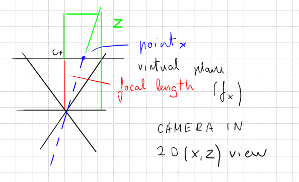
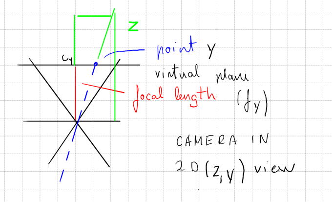

# Perspective Projection, Intrinsics, and Depth

This is **Part 4** of a 4-part series:

1. [Understanding Camera Coordinate Transformations](1_camera_transformation.md)
2. [Orthographic Projection? 📸](2_orthographic_projection.md)
3. [Viewport Transform for Orthographic LiDAR Projection](3_viewport_transform.md)
4. [Perspective Projection, Intrinsics, and Depth](4_perspective_intrinsics_and_depth.md)

---

# Table of Contents

- [Perspective Projection, Intrinsics, and Depth](#perspective-projection-intrinsics-and-depth)
- [Table of Contents](#table-of-contents)
- [Glossary](#glossary)
- [Assumptions](#assumptions)
- [Intro](#intro)
- [1. The Intrinsic Matrix](#1-the-intrinsic-matrix)
- [2. Principal Point: `cx`, `cy`](#2-principal-point-cx-cy)
- [3. Focal Length in Pixels: `fx`, `fy`](#3-focal-length-in-pixels-fx-fy)
  - [What focal length really does](#what-focal-length-really-does)
- [4. Pixel to Ray](#4-pixel-to-ray)
  - [First let's talk about the virtual image plane](#first-lets-talk-about-the-virtual-image-plane)
  - [Pixel to Ray](#pixel-to-ray)
- [5. Back-Projection into 3D](#5-back-projection-into-3d)
- [6. Creating a Point Cloud](#6-creating-a-point-cloud)
- [7. Enjoy your life back in 3D space](#7-enjoy-your-life-back-in-3d-space)
- [References](#references)

---


# Glossary

- **Pinhole (Camera Center)**: The theoretical single point where all incoming light rays intersect before hitting the image sensor.
- **Virtual Image Plane**: A mathematical construct placed *in front* of the camera center. It represents the image correctly oriented (upright), rather than working with the physically upside-down image on the real sensor.
- **Intrinsic Matrix**: A matrix that maps camera-space ray directions to image pixels. Its inverse maps pixels back to viewing rays.
- **Principal Point ($c_x, c_y$)**: The physical "center of vision" on the sensor; the exact pixel where the camera looks directly straight ahead.
- **Focal Length ($f_x, f_y$)**: The distance from the pinhole to the virtual image plane, measured in pixel units, which dictates the field of view.
- **Depth Map**: An array matching the image resolution where each pixel encodes the visible surface's depth. In this post, each value is Z-depth: the forward distance to the surface measured parallel to the camera's optical axis.
- **Back-Projection**: The operation that converts a pixel and its depth into a 3D point in camera coordinates.
- **Point Cloud**: A collection of reconstructed 3D points.
- **Surface Normal**: A unit vector perpendicular to a surface or fitted plane.
- **Plane Coordinates**: A 2D metric coordinate system attached to a 3D plane.

# Assumptions

- This post assumes that the depth map stores Z-depth, measured parallel to the camera's optical axis. It is not the Euclidean distance along the viewing ray, except at the principal point. See [Z-Depth vs Euclidean Depth in Perspective Projection](z_depth_vs_euclidean_depth.md) for a detailed comparison.
- The depth map is registered to the image, so pixel $(x,y)$ and depth $Z(x,y)$ describe the same camera ray.
- The plane-measurement method assumes that the measured surface is approximately planar. Curved surfaces require a mesh or local surface model.
- focal length "f" is given in pixel units

# Intro

In the orthographic projection posts, the useful simplification was this:

> A pixel can be treated as a constant-sized square in the real world.

That is why orthographic projection is easier for measurement. Once we know the scale, pixel distance can be converted back into real distance with simple multiplication.

Perspective projection breaks this assumption.

In perspective projection, a pixel is not a fixed-size square in the world. A pixel identifies a viewing ray leaving the camera. To recover metric geometry, we point that ray back into the 3D world and determine where it meets the visible surface.

Parallel train tracks    


This is also how our eyesight works. In real world its not possible to directly obtain ortographic projection.

This is why an RGB-D measurement pipeline becomes important in the real world. It combines 

1. image taken with perspective projection using camera intrinsics
2. a Z-depth map (this can be derived from LiDAR, photogrammetry, or another depth source)


In essence
- The intrinsics tell us where a pixel is looking.
- The Z-depth tells us how far forward the visible surface is at that pixel.

Together they let us reconstruct visible points in 3D. We can then estimate the surface plane and calculate physical dimensions in that plane.

---

# 1. The Intrinsic Matrix

The camera intrinsic matrix usually looks like this:

$$
K =
\begin{pmatrix}
f_x & 0 & c_x \\
0 & f_y & c_y \\
0 & 0 & 1
\end{pmatrix}
$$

For example, a calibrated camera might have this intrinsic matrix:

```python
m = np.array([
    [3003.1174, 0, 2011.17],
    [0, 3003.1174, 1514.9209],
    [0, 0, 1]
])
```

So:

```text
fx = 3003.1174
fy = 3003.1174
cx = 2011.17
cy = 1514.9209
```


Definitions:

- `fx`: focal length **in pixels** in the horizontal direction.
- `fy`: focal length **in pixels** in the vertical direction.
- `cx`: x-coordinate of the principal point, in pixels.
- `cy`: y-coordinate of the principal point, in pixels.

These four values define how image pixels relate to camera rays.

---

# 2. Principal Point: `cx`, `cy`

The principal point is:

> The pixel where the camera is looking straight ahead.

It is located on the sensor.
It is not exactly the same thing as the image center, although it is usually close.

The image center is just the geometric middle of the rectangular image:

```text
image center = (image_width / 2, image_height / 2)
```

The principal point is physical:

```text
principal point = where the lens optical axis hits the sensor
```

In a perfect camera, those would be exactly the same. In a real camera, the lens and sensor are not mounted with mathematical perfection, so calibration gives us the actual principal point.

For example, if an image is roughly `4032 x 3024`, then the image center is:

```text
(2016, 1512)
```

This example principal point is:

```text
(2011.17, 1514.9209)
```

That is very close to the center, but not exactly. It is about 4.8 pixels left and 2.9 pixels down from the image center.

The useful mental model is:

```text
(cx, cy) = the zero point for camera direction
```

If a pixel is exactly at `(cx, cy)`, then it looks straight forward from the camera.

If a pixel is to the right of `cx`, then it looks a bit to the right.

If a pixel is to the left of `cx`, then it looks a bit to the left.

Same for `cy` vertically.

This is why the code uses:

```python
x - cx
y - cy
```

It is asking:

```text
How far is this pixel from the straight-ahead pixel?
```

---

# 3. Focal Length in Pixels: `fx`, `fy`

The values `fx` and `fy` are focal lengths, but measured in pixels.

That sounds strange at first because focal length is often described in millimeters. But for image geometry, pixel units are more practical.

In the ideal geometric picture, focal length is the forward distance from the
pinhole to the image plane. In a calibrated intrinsic matrix, however, `fx`
and `fy` should be treated directly as two independently estimated
pixel-coordinate scale parameters.

They may be equal, but the projection equations do not require this. They can
differ because of image-axis scaling, resizing, non-square sampling, or the
camera-calibration result. No assumption about a known physical focal length
or physical pixel size is needed for the reconstruction below.


## What focal length really does

- `fx` is the horizontal version. It tells us how much moving left or right in the image changes the left-right viewing angle.
- `fy` is the vertical version. It tells us how much moving up or down in the image changes the up-down viewing angle.

Large `fx` means:

```text
same pixel offset = smaller angle
```

That is like a zoomed-in / narrow field-of-view camera.

Small `fx` means:

```text
same pixel offset = larger angle
```

That is like a wide-angle camera.

The same applies to `fy`, but vertically.

In this example, `fx` and `fy` are equal:

```text
fx = fy = 3003.1174
```

That means this example assumes the camera has the same scaling horizontally and vertically. In practical terms, square pixels and symmetric focal scaling. This is commonly assumed.

---

# 4. Pixel to Ray

## First let's talk about the virtual image plane

In the pinhole camera model, the real image sensor sits behind the small camera hole / camera center.

That real image plane receives an upside-down version of the world, because light rays cross at the pinhole before they hit the sensor.

For geometry, that flipped picture is annoying. So instead of drawing the image plane behind the pinhole, we usually draw a **virtual image plane** in front of the pinhole, between the camera and the scene. 

It represents almost the same thing as the actual image plane, but inverted to the front side:

```text
scene
    |
    |
virtual image plane
    |
camera center / pinhole
    |
real image plane / sensor
```

The virtual image plane is not a physical surface inside the camera. It is a mathematical helper. It lets us say that a pixel is in front of the camera and that the ray goes from the camera center through that pixel into the world. 

- **It is the same distance from the pinhole as the real image plane is**

So the virtual image plane is basically the real image plane mirrored through the pinhole. Same projection idea, but with the inconvenient upside-down sensor image turned into a forward-facing construction.

## Pixel to Ray

- Depth Z combined with perspective camera on X,Z plane


- Depth Z combined with perspective camera on X,Y plane



- As you can see, Z in both visuals remains same, but the f_x and f_y could change.
- A pixel has image coordinates $(x,y)$. Relative to the principal point,
  its offsets are $x-c_x$ horizontally and $y-c_y$ vertically.
- In the horizontal X-Z cross-section, the pixel offset and focal scale form
  the small reference triangle $(x-c_x,f_x)$. The corresponding camera-space
  point forms the larger triangle $(X,Z)$. These triangles are similar because
  both lie along the same camera ray.
- As triangles are similiar, we can say:

  $$
  \frac{Z}{f_x}=\frac{X}{x-c_x},
  $$

  and rearranging gives

  $$
  X=Z\frac{x-c_x}{f_x}.
  $$

- The same argument in the vertical Y-Z cross-section uses the triangle
  $(y-c_y,f_y)$ and gives

  $$
  \frac{Z}{f_y}=\frac{Y}{y-c_y}
  \qquad\Longrightarrow\qquad
  Y=Z\frac{y-c_y}{f_y}.
  $$

- The depth $Z$ is the same in both cross-sections because they describe the
  same 3D point. Combining the two derivations gives

  $$
  P=(X,Y,Z)=
  \left(
  Z\frac{x-c_x}{f_x},
  Z\frac{y-c_y}{f_y},
  Z
  \right).
  $$

- If we now divide the vector by Z, we get

```python
q = np.array([
  (x - cx) / fx,
  (y - cy) / fy,
  1.0,
])
``` 
- This is a commong representation of pixels on virtual plane as it allows easy transfer with depth back to the 3D space.

-  $(x-c_x)/f_x$ and $(y-c_y)/f_y$ first describe the ray's horizontaland vertical displacement per unit of forward motion. Multiplying both by
  the measured camera-axis depth $Z$ converts those ratios into metric $X$
  and $Y$ coordinates.


# 5. Back-Projection into 3D

Projection through lens maps a 3D point to a pixel. **Back-projection** reverses the directional part of that mapping.

From previous we have

$$
q=
\begin{pmatrix}
\dfrac{x-c_x}{f_x} \\[6pt]
\dfrac{y-c_y}{f_y} \\[6pt]
1
\end{pmatrix}.
$$

The vector $q$ is a camera-space ray direction scaled so that its forward
component is $1$. Every point on that ray has the form:

$$
P(s)=sq, \qquad s>0.
$$


A pixel alone therefore does not identify one phyisical 3D point. It identifies infinitely many possible points along one ray. 

Thus having Z, based on previous logic above we can create 3D point

$$
P=Zq=
\begin{pmatrix}
Z\dfrac{x-c_x}{f_x} \\[6pt]
Z\dfrac{y-c_y}{f_y} \\[6pt]
Z
\end{pmatrix}.
$$


---

# 6. Creating a Point Cloud

Back-project every valid depth pixel to create a point cloud of the visible surface:

```python
def depth_map_to_points(depth, fx, fy, cx, cy, mask=None):
  valid = np.isfinite(depth) & (depth > 0)
  if mask is not None:
    valid &= mask

  pixel_y, pixel_x = np.nonzero(valid)
  z_depth = depth[pixel_y, pixel_x]

  point_x = z_depth * (pixel_x - cx) / fx
  point_y = z_depth * (pixel_y - cy) / fy

  return np.column_stack((point_x, point_y, z_depth))
```

Each row of the result is a point $(X,Y,Z)$ in camera coordinates. Applying an object mask before back-projection keeps only the 3D points associated with that object.

For plane estimation, use reliable interior points. Depth near an object boundary may mix foreground and background measurements, so invalid values and outliers should be removed first.

---


# 7. Enjoy your life back in 3D space

- 2D is nice and colorful but people need depth.

# References

- [Dissecting the Camera Matrix, Part 3: The Intrinsic Matrix](https://ksimek.github.io/2013/08/13/intrinsic/)
- [Focal Length and Intrinsic Camera Parameters](https://www.baeldung.com/cs/focal-length-intrinsic-camera-parameters)
- [Intrinsic and Extrinsic Parameters of Pinhole Camera](https://robotlabx.com/blog/2024-01-10-Intrinsic-and-extrinsic-parameters-of-pinhole-camera/)
