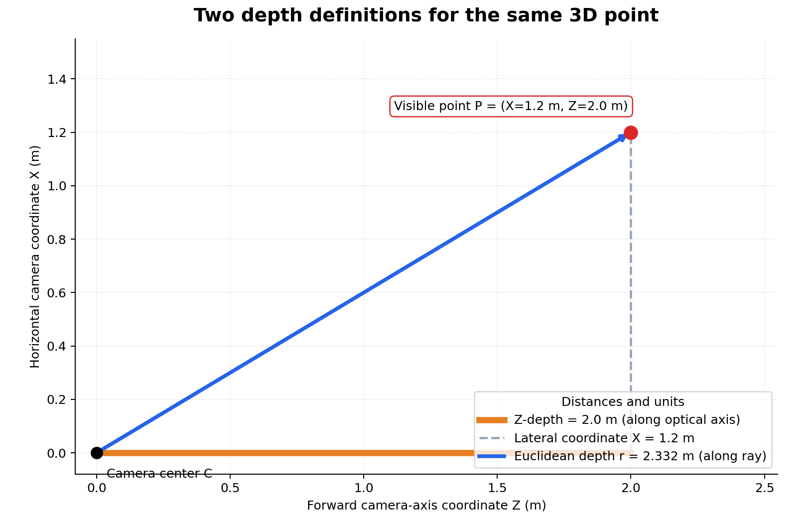
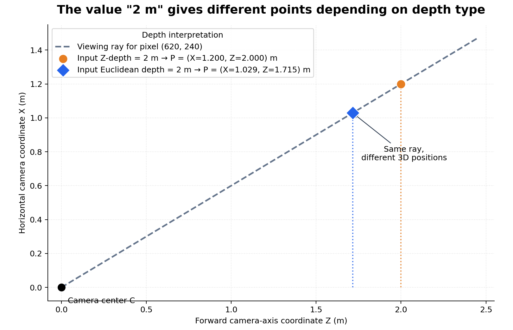

# Z-Depth vs Euclidean Depth in Perspective Projection

This is **Part 7** of the series:

1. [Understanding Camera Coordinate Transformations](1_camera_transformation.md)
2. [Orthographic Projection? 📸](2_orthographic_projection.md)
3. [Viewport Transform for Orthographic LiDAR Projection](3_viewport_transform.md)
4. [Perspective Projection, Intrinsics, and Depth](4_perspective_intrinsics_and_depth.md)
5. [Orthographic vs Perspective: Scaling, the Perspective Divide, and Getting to Pixels](5_ortho_vs_perspective_scaling.md)
6. [Measuring Objects Viewed at an Angle in Perspective Images](6_objects_under_angle_perspective.md)
7. [Z-Depth vs Euclidean Depth in Perspective Projection](7_z_depth_vs_euclidean_depth.md)
8. [Creating a Point Cloud from Pixels and Depth](8_pixels_and_depth_to_point_cloud.md)

---

# Table of Contents

- [1. The Difference](#1-the-difference)
- [2. Reconstructing a 3D Point](#2-reconstructing-a-3d-point)
- [3. Worked Example](#3-worked-example)
- [4. Converting Between the Two](#4-converting-between-the-two)
- [5. The Common Mistake](#5-the-common-mistake)
- [6. The Short Version](#6-the-short-version)

---

# 1. The Difference

A depth value does not always mean the same thing.

For a camera-space point

$$
P=(X,Y,Z),
$$

two common definitions are:

| Depth type | Meaning | Formula |
|---|---|---|
| **Z-depth** | Forward distance measured parallel to the camera's optical axis | $Z$ |
| **Euclidean depth** or **range** | Straight-line distance from the camera center to the point | $r=\sqrt{X^2+Y^2+Z^2}$ |



*The orange line is Z-depth along the optical axis, while the blue line is
Euclidean depth along the viewing ray. All distances are in meters.*

The two values are equal only for a point on the optical axis. Away from the
image center, Euclidean depth is larger because the viewing ray is diagonal.

---

# 2. Reconstructing a 3D Point

For pixel $(u,v)$ and camera intrinsics $(f_x,f_y,c_x,c_y)$, first form the
unnormalized camera ray:

$$
q=
\begin{pmatrix}
\dfrac{u-c_x}{f_x}\\[4pt]
\dfrac{v-c_y}{f_y}\\[4pt]
1
\end{pmatrix}.
$$

Its last component is `1`, so it is convenient when the depth map stores
**Z-depth**:

$$
P=Zq.
$$

If the depth map instead stores **Euclidean depth** $r$, normalize the ray:

$$
d=\frac{q}{\lVert q\rVert},
\qquad
P=rd.
$$

The important distinction is:

```text
Z-depth:       multiply the unnormalized ray q
Euclidean depth: multiply the unit ray d
```

---

# 3. Worked Example

Suppose:

```text
fx = fy = 500 pixels
cx = 320 pixels
cy = 240 pixels
pixel = (620, 240)
```

The pixel is 300 pixels to the right of the principal point:

$$
q=
\begin{pmatrix}
(620-320)/500\\
(240-240)/500\\
1
\end{pmatrix}
=
\begin{pmatrix}
0.6\\
0\\
1
\end{pmatrix}.
$$

The length of this ray vector is:

$$
\lVert q\rVert=\sqrt{0.6^2+0^2+1^2}\approx1.166.
$$

## If the sensor reports Z-depth = 2 m

$$
P=2q=(1.2,\ 0,\ 2.0)\text{ m}.
$$

The point is 2 m forward, but its Euclidean distance from the camera is:

$$
r=\sqrt{1.2^2+2.0^2}\approx2.332\text{ m}.
$$

## If the sensor reports Euclidean depth = 2 m

First normalize the ray:

$$
d=\frac{(0.6,0,1)}{1.166}\approx(0.514,\ 0,\ 0.857).
$$

Then:

$$
P=2d\approx(1.029,\ 0,\ 1.715)\text{ m}.
$$

Now the point is exactly 2 m from the camera, but only about 1.715 m forward.

| Input value | Resulting point $(X,Y,Z)$ in meters | Other depth |
|---|---|---|
| Z-depth = 2 m | $(1.200,0,2.000)$ | Euclidean depth = 2.332 m |
| Euclidean depth = 2 m | $(1.029,0,1.715)$ | Z-depth = 1.715 m |



*Both points lie on the same viewing ray, but interpreting `2 m` as Z-depth
places the point farther from the camera than interpreting it as Euclidean
depth.*

This is why using the correct depth definition matters most near the edges of
an image. At the principal point, $q=(0,0,1)$, so both definitions give the
same result.

---

# 4. Converting Between the Two

Because

$$
P=Zq=rd,
$$

the conversion is:

$$
r=Z\lVert q\rVert
$$

and:

$$
Z=\frac{r}{\lVert q\rVert}.
$$

Written directly using the pixel and intrinsics:

$$
r=
Z\sqrt{
\left(\frac{u-c_x}{f_x}\right)^2+
\left(\frac{v-c_y}{f_y}\right)^2+
1
}.
$$

---

# 5. The Common Mistake

If a sensor gives Euclidean depth $r$, this is wrong:

```python
point = r * ray
```

when `ray` is the unnormalized vector $q$. The resulting point will be farther
than $r$ from the camera.

Use:

```python
ray = np.array([
    (u - cx) / fx,
    (v - cy) / fy,
    1.0,
])

if depth_type == "z":
    point = depth * ray
elif depth_type == "euclidean":
    point = depth * ray / np.linalg.norm(ray)
else:
    raise ValueError(f"Unknown depth type: {depth_type}")
```

Always check the sensor or library documentation for terms such as
`z-depth`, `axial depth`, `range`, `radial depth`, or `distance`.

---

# 6. The Short Version

- **Z-depth** measures how far forward the point is.
- **Euclidean depth** measures the straight-line distance to the point.
- Use $P=Zq$ for Z-depth.
- Use $P=r(q/\lVert q\rVert)$ for Euclidean depth.
- They are equal at the principal point and increasingly different toward the
  image edges.

In one sentence:

> Z-depth follows the camera's forward axis; Euclidean depth follows the pixel's viewing ray.
