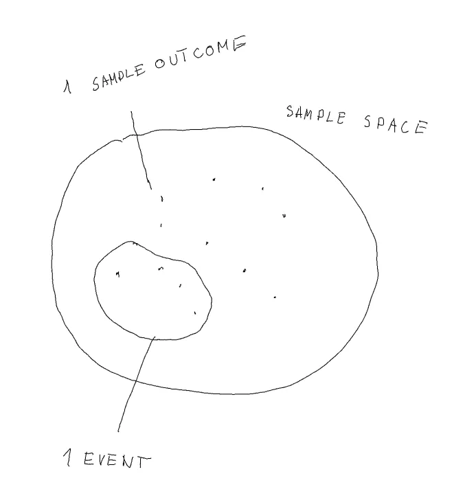

# Defining Probability

- [Defining Probability](#defining-probability)
  - [Probability Space](#probability-space)
    - [Example](#example)
  - [Lets define probability](#lets-define-probability)
    - [Explaining  $\\Omega$ - $2^n$ with Example](#explaining--omega---2n-with-example)
    - [Assigning probabilities (fair die → each sample outcome equally likely):](#assigning-probabilities-fair-die--each-sample-outcome-equally-likely)

## Probability Space

First we will define Probability Space, it consists of

- **Sample Space $\Omega$**
- **Points** in **Sample Space** are called **Sample Outcomes** 
- **Subsets** of **Sample Space** are called **Events**

### Example

We have an experiment with 1 draw from pack of cards:

- Sample Space - All possible draws
- Sample Outcome - (Elementaarsündmus)
    - 1 card draw
- Example Events - (1 Event  can contain multiple Sample Outcomes)
    - Draw any card from Spades
    - Draw any card more powerful than 6
    
## Lets define probability

**P,$\Omega$,F**

- First we need to define F, the Events Space 
  - Event Space contains all possible events from Sample Space . 
  - This is it contains all possible subsets of Sample Outcomes from Sample Space. 
  - There is total  $\Omega$ - $2^n$  subsets like that:
    -  n is the amount of sample outcomes
- Probability assigns now any event in F a certain probability P

### Explaining  $\Omega$ - $2^n$ with Example

Consider a simple experiment: **rolling a fair six-sided die**.

- **Sample Space**: $\Omega = \{1, 2, 3, 4, 5, 6\}$
- **Sample Outcomes**: Each face value, e.g., rolling a 3
- **Event Space** $F$: All $2^6 = 64$ possible subsets of $\Omega$
- **Some example events**:
    - $A = \{2, 4, 6\}$ — rolling an even number
    - $B = \{4, 5, 6\}$ — rolling a number greater than 3

**To bring this into even simple terms**: each column here stands for whether a sample outcome happened or did not happen (1/0). This means all subsets will be multiplications on 2/binary options.

| Event | 1 | 2 | 3 | 4 | 5 | 6 |
|-------|---|---|---|---|---|---|
| $\{1\}$ | ✓ | | | | | |
| $\{2, 4\}$ | | ✓ | | ✓ | | |
| $\{1, 3, 5\}$ | ✓ | | ✓ | | ✓ | |
| $\{4, 5, 6\}$ | | | | ✓ | ✓ | ✓ |
| $\{2, 3, 4, 5\}$ | | ✓ | ✓ | ✓ | ✓ | |
| ... | | | | | | |

### Assigning probabilities (fair die → each sample outcome equally likely):

| Event | Outcomes | Probability |
|---|---|---|
| Roll an even number $A$ | $\{2, 4, 6\}$ | $P(A) = \frac{3}{6} = 0.5$ |
| Roll greater than 3 $B$ | $\{4, 5, 6\}$ | $P(B) = \frac{3}{6} = 0.5$ |
| $A \cap B$ (even **and** greater than 3) | $\{4, 6\}$ | $P(A \cap B) = \frac{2}{6} \approx 0.33$ |

**Are A and B independent?**
>
> Check: $P(A)P(B) = 0.5 \times 0.5 = 0.25$, but $P(A \cap B) \approx 0.33$
>
> Since $P(A \cap B) \neq P(A)P(B)$, events $A$ and $B$ are **not independent**,
 because knowing that the die rolled greater than 3 changes the probability of it being even (from $\frac{1}{2}$ to $\frac{2}{3}$)