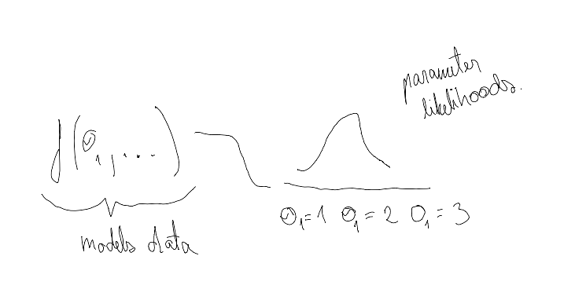

# BAYESIAN LEARNING IDEA

## **CREATING A PROBABILITY DISTRIBUTION FOR THE PARAMETERS FOR THE MODEL**

We always start with Bayes formula for Bayesian Learning. In my oppinion this is not intuitive at all because the actual crux of Bayesian learning comes from this statement 

> With frequentist approach we are updating parameters for model ( Lets call that model of data ) that models data. Bayesian learning goes further. Instead of updating directly parameters of data modeling function, we update the distribution (Lets call that distribution of parameters) that models the parameters for the function modeling the data. Difference is that each parameter for function that models the data now gets it’s own probability distribution. Each instance of parameter now gets its own probability.
> 



The distribution of parameters is created and updated by iterative update process as we get more and more data. In crux: the more likely to see certain data with parameter $\theta$, the more likely we are going to make that $\theta$

$P(\theta|data)=P(\theta)P(data|\theta)$

The simplest way to think of this is to imagine you have a some arbitrary function F() with 10 possible input parameters $\theta_1,\theta_2,..\theta_{10}$ and you have some data that this F() tries to model.  ( *Don’t think about what this F() is but think that you can get from it $P(data|\theta_i)$: the likelihood of seeing data assuming parameter $\theta_i$* )

You will now try out to get the likelihood of seeing data with each of these parameters 

```python

data = {..}
thetas = [..] # Lets assume 10 different thetas
theta_distribution = [] # This is what P(theta) means. For each theta we have a probability

for idx, theta in enumerate(thetas):
	theta_distribution[idx] = \
		theta_distribution[idx] * get_data_likelihood_with_theta(theta,data)
```

_Todo:  insert some examples here_

Having made a an example for the updating the distribution of parameters based on the data we have seen, we can look now at the Bayes Theorem 

$P(A|B) = \frac{P(B|A_j)P(A_j)}{\sum P(B|A_i)P(A_i)}=\frac{P(B|A_j)P(A_j)}{P(B)}=\frac{P(AB)}{P(B)}$

1. What is the probability of B? Assuming $A_j$ is part of full system. ($\sum P(A_j)=1$  (No common area between A-s)) we can get P(B) by adding up all probabilities of B with all possible A-s  
2. What is the probability of P($A_j$) happening and What is the probability of P(B| $A_j$) happening?
    1. If we multiply these things together we get probability of P(AB)
3. $\frac{P(AB)}{P(B)} = P(A|B)$, this is just formula for conditional probability

Lets formulate this now with data and $\theta$

- $P(\theta|data) 
=\frac{P(data|\theta)P(\theta)}{P(data)}$

- P(data) is in the literature always considered as 1 - _This has confused me a lot.Basic explanation is that is assumed to be because seeing data is 1 with all different param values on the model is 1_
- As we are modeling the parameters with **distribution** we can get into the process of updating that **distribution.**  Aka how much we believe in certain parameter combinations. 

- In this case the Bayesian logic starts to slowly come into play as we are updating our Prior beliefs on 
$\theta$, ($P(\theta)=Prior$) based on how likely it is to see data given those parameters $P(data|\theta)$

**EXAMPLE 1** 

You have an experiment 10 coin flips where 8 flips are successful. 

The coin flips experiments are modeled with Binomial distribution. 

- What is the probability of differen parameters for binomial based  on the experiment result?
- What is the current bee

<Insert YT video about coin flips>

**EXAMPLE 2**

- With regular linear regression y=tx+b we are just point predicting t and b - this is the frequentist method.


With bayesian approach we have distributions for both t and b. Those distributions can be whatever (normal,beta,poisson, or we can have probability for each t and b). We are updating the parameters for those distributions. E.g the parameters for the distributions that model parameters that model data. 

In essence we have

- Some model for data - With linear regression this is y=tx+b - lets call it MODEL1
- Some parameters for MODEL1, in this case these are t and b
- Some distributions for t and b MODEL 2
    - These distributions can now be parameterized - (represented by some function (For example normal distribution)) -
        - In the case of parameterized distribution getting from prior to posterior here lies on the concept modeling parameters with functions that are conjugate prior to the posterior function.
        - In simpler case we can have some sample and give some probability for each sample.

**SIMPLE CASE** 

The simplest example I found in the internet was this [link](https://tartuulikool-my.sharepoint.com/:b:/r/personal/antsnamm_ut_ee/Documents/Doktorit%C3%B6%C3%B6/Artiklid/BayesFromScratch.pdf?csf=1&web=1&e=7QPcN0) (Hint, its not that simple but it allowed me to get the idea of 1 method hoe bayesian learning could be used.)

It explains doing regression with Bayesian Learning. 

- For each parameter in y=tx+b, mainly t and b, we are assiging some probabilities.
- We are updating those parameters with formula from Bayes theorem
    - P(Posterior) = P(Prior) * Likelihood of specific Prior
        - = P(Given parameter | data ) = P(Likelihood of given parameter seeing the data) P(Given parameter before seeing data)
        - This follows bayes theorem
    - This update is just simple looping through all parameter combinations, calculating the likelihood and then multiplying (prior probability) with (likelihood of data given these parameters)

# NOW WE CAN TALK ABOUT BAYES THEOREM

The first thing you need to understand is conditional probability

$P(A|B)=\frac{P(A \cap B)}{B}$

$P(B|A)=\frac{P(A \cap B)}{A}$

**BAYES THEOREM** 

Also in medicine there is this cancer example. Question is, if we have received a positive cancer result, what is the probability of cancer? We know that the test is able to predict cancer with 0.9 probability, when cancer really occurs. We also know that the test can predict cancer with 0.9 probability when no cancer occurs. 

- We know probabilities
    - P(cancer) = 0.00001 probability ⇒ P(no cancer) = 0.99999 probability
    - P(positive test result | cancer)  = 0.9 probability
    - P(positive test result | no cancer)  = 0.1 probability
- Methodology
    - The example is built on receiving test result that says cancer. What is the probability you really have cancer? Me saame siin kasutada **tingliku tõenäosuse/conditional probability** [definitsiooni](https://www.notion.so/Bayesian-Learning-90b47f368f5649f7b9a76255f3b85667?pvs=21)
        - P( cancer | positive test) = $\frac{\text{cancer and positive test}}{\text{positive test}}$
    - What is total probability of receiving positive test - We use [total **probability rule](https://www.notion.so/Bayesian-Learning-90b47f368f5649f7b9a76255f3b85667?pvs=21) /täistõenäousus combination with [Täistõenäosuse valem $P(A)=\sum P(B_i)P(A_i)$ kus $B_i$ on üksteist välistavad sündmused](https://www.notion.so/T-ist-en-osuse-valem-P-A-sum-P-B_i-P-A_i-kus-B_i-on-ksteist-v-listavad-s-ndmused-ead61da6272949189f67f20eb1e68144?pvs=21)**  to calculate this:
        - You have cancer and you get positive result = P(positive | cancer) P(cancer) = 0.9*0.00001
        - You don’t have cancer and the test is making mistake P( positive | no cancer)P(no cancer) = 0.1*0.99999
        - Täistõenäosus =  0.9*0.00001   +  0.1*0.99999
    - **Bayes Theorem**
        - $P(cancer|positive)=\frac{\text{cancer and positive test}}{ positive}=\frac{P(positive|cancer)P(cancer)}{P(positive|cancer)P(cancer)+P(\text{positive|no cancer})P(\text{no cancer})}=\frac{0.9*0.00001}{ 0.9*0.00001   +  0.1*0.99999}$

PS

|           | POSITIVE                                         | NEGATIVE                                         | SUM                  |
| --------- | ------------------------------------------------ | ------------------------------------------------ | -------------------- |
| CANCER    | P(positive \| cancer)P(cancer)=0.9*0.00001       | P(negative \| cancer)P(cancer)=0.1*0.00001       | P(cancer)=0.00001    |
| NO CANCER | P(positive \| no cancer)P(no cancer)=0.1*0.99999 | P(negative \| no cancer)P(no cancer)=0.9*0.99999 | P(no cancer)=0.99999 |
| SUM       | P(positive)=0.9*0.00001+0.1*0.99999              | P(negative)=0.1*0.00001+0.9*0.99999              | 1                    |

# REFERENCE

- [Bayesian Regression From Scratch. Deriving Bayesian Linear Regression… | by Egor Howell | Towards Data Science](https://towardsdatascience.com/bayesian-regression-from-scratch-a1fe19ff64c)

LK 37-42 Kalev Pärna Tõenäosusteooria algkursuses

- Tingliku tõenäosuse definitsioon $P(A|B)=\frac{P(AB)}{P(B)}$
- Tõenäosuste korrutamise valem (Järeldub tingliku tõenäosuse definitsioonist)
    - $P(AB)=P(A|B)P(B)=P(B|A)P(A)$
- Täistõenäosuse valem $P(A)=\sum P(B_i)P(A_i)$ kus $B_i$ on üksteist välistavad sündmused
- Bayes Theorem - paneme eelneva kolm kokku, et saada Bayes Theorem
    - $P(A|B) = \frac{P(B|A_j)P(A_j)}{\sum P(B|A_i)P(A_i)}=\frac{P(B|A_j)P(A_j)}{P(B)}=\frac{P(AB)}{P(B)}$
    - See annab meile võimaluse saada kätte tõenäosus, et on A kui on juhtunud B - Äge on see, et me saame selle valemiga tuletada teadmisest, Mis on B tõenäosus, kui juhtub A
    

