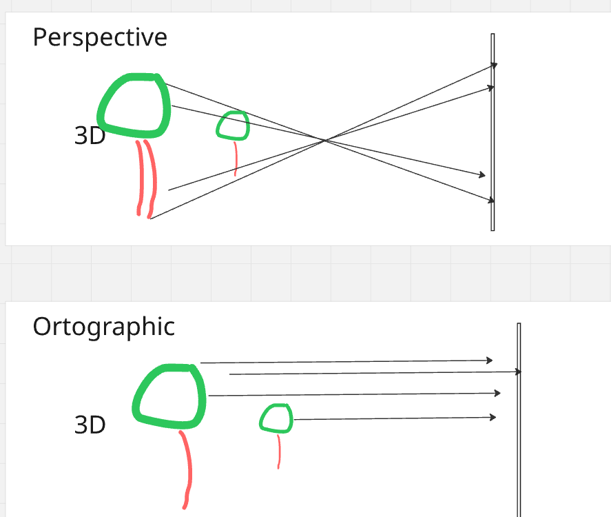
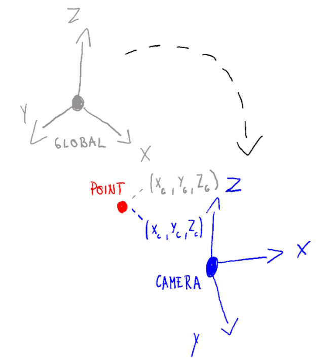

# Orthographic Projection? 📸

Have you ever wondered how we represent 3D objects on a 2D screen? One of the ways to do this is through **orthographic projection**. In simple terms, orthographic projection is a way of drawing a 3D object in 2D that preserves the object's proportions, no matter how near or far it is. This is different from perspective projection, which makes objects appear smaller as they get farther away. This is particularly useful in technical drawings, such as architectural plans or engineering designs, where it's important to maintain the exact measurements of the object.

This is **Part 2** of a 4-part series:

1. [Understanding Camera Coordinate Transformations](camera_transformation.md)
2. [Orthographic Projection? 📸](orthographic_projection.md)
3. [Viewport Transform for Orthographic LiDAR Projection](viewport_transform.md)
4. [Perspective Projection](perspective_projection.md)

---

- [Orthographic Projection? 📸](#orthographic-projection-)
- [Step 1: From a World of Points to a Camera's View](#step-1-from-a-world-of-points-to-a-cameras-view)
- [Step 2: Flattening the World: Projecting to 2D](#step-2-flattening-the-world-projecting-to-2d)
- [Deeper Dive Into Step 2](#deeper-dive-into-step-2)
  - [1. Defining the View Volume](#1-defining-the-view-volume)
  - [2. Target Space – The NDC Cube](#2-target-space--the-ndc-cube)
  - [3. The Orthographic Projection Transformation](#3-the-orthographic-projection-transformation)
  - [4. Orthographic Projection Matrix](#4-orthographic-projection-matrix)
  - [5. How It Works – Example for X Coordinates](#5-how-it-works--example-for-x-coordinates)
  - [✅ Key Points](#-key-points)
  - [Putting It All Together](#putting-it-all-together)
- [References](#references)

# Step 1: From a World of Points to a Camera's View 

Before doing projection to a plane, we have points in 3D world. We can assume these are defined on some global coordinate system with its own origin and axes. This is a global reference frame for everything in your scene. But to see this car, you need a camera. The camera has its own coordinate system, with its own origin and axes.

The first step in orthographic projection is to transform the car's points from the world coordinate system to the camera's coordinate system. This is like moving and rotating the entire world so that the camera is at the origin (0,0,0) and looking down a specific axis, usually the negative Z-axis. This transformation is done using a "view matrix", which combines translation and rotation to position the scene correctly from the camera's perspective.

Read more details about this in another article [Transforming To Global Coordinate System](camera_transformation.md)

---

# Step 2: Flattening the World: Projecting to 2D 

Now that our car is positioned correctly in front of the camera, we need to project it onto a 2D plane. In orthographic projection, this is like taking a rectangular box and mapping everything inside it to a 2D screen. Anything outside this box is "clipped" and won't be visible.

The projection itself is quite simple: we just discard the depth information (the Z-coordinate) of each point. However, to make things work with modern graphics pipelines, we use a special "orthographic projection matrix". This matrix not only gets rid of the depth but also scales and translates the X and Y coordinates to fit within a standard cube, usually from -1 to 1 on each axis. This normalized representation is what eventually gets mapped to the pixels on your screen, giving you the final 2D image of the object. 

# Deeper Dive Into Step 2

## 1. Defining the View Volume

In orthographic projection, the camera’s **view volume** is a rectangular box in **camera space** defined by six clipping planes:

- **Left**: l
- **Right**: r
- **Bottom**: b
- **Top**: t
- **Near**: n
- **Far**: f

All distances are measured from the camera’s origin.

In a **right-handed coordinate system** like OpenGL, the camera looks down the **−Z axis**. Read more about coordinate system handedness [here](right_hand_vs_left_hand.md)

---

## 2. Target Space – The NDC Cube

Graphics hardware works with a standard shape called the **Normalized Device Coordinates (NDC) cube**:

- Ranges from **−1 to 1** along x, y, and z.
- Centered at the origin (0, 0, 0).
- Dimensions: 2 × 2 × 2.

Our goal: **Map every point from the camera’s view volume into this cube** so the GPU can perform clipping and screen mapping efficiently.

---

## 3. The Orthographic Projection Transformation

The orthographic projection step does **two things**:

1. **Translate** the view volume points so that its center is at the origin.
2. **Scale** the volume points so that it fits exactly inside the `[−1,1][-1,1][−1,1]` cube.

These two steps can be combined into **one matrix multiplication**.

---

## 4. Orthographic Projection Matrix

For a right-handed coordinate system (OpenGL convention), the orthographic projection matrix is:

$$
M_{\text{ortho}} =
\begin{pmatrix}
\frac{2}{r-l} & 0 & 0 & -\frac{r+l}{r-l} \\
0 & \frac{2}{t-b} & 0 & -\frac{t+b}{t-b} \\
0 & 0 & \frac{2}{n-f} & \frac{f+n}{f-n} \\
0 & 0 & 0 & 1
\end{pmatrix}  
$$

---

## 5. How It Works – Example for X Coordinates

The **first row** of the matrix performs a standard linear remapping from the range $[l, r]$ to $[-1, 1]$.

That sentence sounds more complicated than it is. It just means this:

- A point on the **left** side of the view box, $x = l$, should become $-1$.
- A point on the **right** side of the view box, $x = r$, should become $1$.
- A point exactly in the **middle** between $l$ and $r$ should become $0$.

So we want a formula that takes the old x-coordinate and gives us a new x-coordinate in the normalized range

$$
x_{\text{new}} =
\left( \frac{2}{r-l} \right) x_{\text{old}}
- \left( \frac{r+l}{r-l} \right)
$$

This formula does two simple operations:

1. **Scale** the x-values by $\frac{2}{r-l}$.
2. **Shift** them by $-\frac{r+l}{r-l}$.

Why those two parts?

- **Scale part:** the original interval has width $r-l$, while the target interval $[-1,1]$ has width $2$. So the factor $\frac{2}{r-l}$ rescales the old interval to the correct width.
- **Shift part:** after scaling, the numbers are still not in the right place. The term $-\frac{r+l}{r-l}$ slides the whole interval left or right so its middle ends up at $0$.
  - More abstractly: the midpoint of the original interval $[l,r]$ is $\frac{l+r}{2}$. After scaling by $\frac{2}{r-l}$, that midpoint becomes

$$
\left( \frac{2}{r-l} \right) \frac{l+r}{2} = \frac{r+l}{r-l}
$$

  Since we want the final midpoint to be $0$, we must subtract exactly that value. That is why the shift term is $-\frac{r+l}{r-l}$: it cancels the scaled midpoint and centers the interval at the origin.

Similarly:

- Y row: maps [b,t][b, t][b,t] → [−1,1][-1, 1][−1,1]
- Z row: maps camera-space [−f,−n][-f, -n][−f,−n] → [−1,1][-1, 1][−1,1]

---

## ✅ Key Points

- Start with **camera space** coordinates.
- Define the **view volume** using l,r,b,t,n,fl, r, b, t, n, fl,r,b,t,n,f.
- Apply $M_{\text{ortho}}$ to normalize into NDC space.
  - NDC space makes clipping and rendering much simpler for the GPU.
  - NDC space also eases the general logic to more common ground
---

## Putting It All Together

To get a vertex from its original position in the world all the way to the final pre-screen space (called **Clip Space**), we combine the matrices. The full transformation is:

$$
P_{clip} = M_{ortho} \cdot M_{view} \cdot P_{world}
$$

The resulting Pclip coordinates are almost final. The hardware then performs two last, simple steps:

1. **Clipping**: Any vertex with an x, y, or z coordinate outside the [-1, 1] range is discarded.
2. **Viewport Transform**: The surviving NDC coordinates are mapped to the pixel coordinates of your window or screen. For example, an x-coordinate of -1 becomes the left edge of the screen, and +1 becomes the right edge.

The viewport transform is the next step in this series, covered in [Viewport Transform for Orthographic LiDAR Projection](viewport_transform.md).

This post builds directly on [Understanding Camera Coordinate Transformations](camera_transformation.md), which is Part 1 of the series.

# References

1. [YT video about orto projections](https://www.youtube.com/watch?app=desktop&v=NaclfcHReXk&ab_channel=3DComputerGraphics%3AMathIntrow%2FOpenGL)
2. [Understanding Camera Coordinate Transformations](https://www.notion.so/Understanding-Camera-Coordinate-Transformations-2442e1a674b3809386c3ea125e65a9d7?pvs=21)
