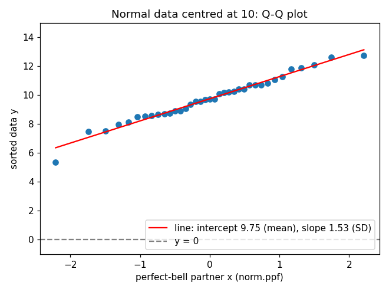
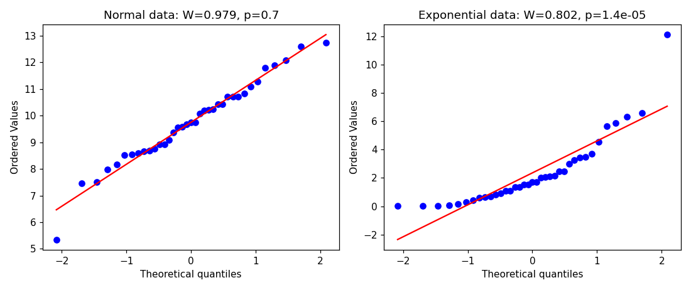

# Q-Q Plot and Shapiro-Wilk Test

**Q: Why check normality at all?**  
A t-test measures how far the mean is from 0 in units of noise, then looks up how rare that is using the bell-curve (t) distribution. If the data is strongly skewed or has outliers, that lookup is wrong, so the p-value and the confidence interval can't be trusted.

With around 37 items the *mean* is already more bell-like than the data itself (central limit theorem), so mild non-normality is tolerable. Strong skew or a wild outlier is not.

---

**Q: Which thing must be normal?**  
Not the raw values. The **paired per-item differences**.

Example: we measure the same 37 logs with a new method and with a reference method. For each log:

$$
d_i = \text{new}_i - \text{reference}_i
$$

The 37 values $d_i$ are what the t-test works on, so the 37 values $d_i$ are what we check.

---

**Q: What is a Q-Q plot?**  
A picture that compares your sorted data against what a "perfect bell" sample of the same size would look like. If the dots fall on a straight line, your data looks normal.

---

**Q: How is it built? Tiny example, n = 5.**  
Data: `12, 9, 10, 15, 11`.

1. **Sort** it: `9, 10, 11, 12, 15`. These are the $y$ values.
2. Give each rank a probability slot: $p = \frac{\text{rank} - 0.5}{n}$, so `0.1, 0.3, 0.5, 0.7, 0.9`.
3. Turn each probability into a "perfect bell" value: $x = \text{norm.ppf}(p)$.
4. Plot the pairs $(x, y)$.

| rank | y (sorted data) | p | x = norm.ppf(p) |
|---|---|---|---|
| 1 | 9 | 0.1 | -1.28 |
| 2 | 10 | 0.3 | -0.52 |
| 3 | 11 | 0.5 | 0.00 |
| 4 | 12 | 0.7 | 0.52 |
| 5 | 15 | 0.9 | 1.28 |

Note: $x$ depends **only on n**, never on the data.

---

**Q: What exactly is `norm.ppf`?**  
It is the **inverse cumulative normal**: you give a probability, it gives the value that has that much probability below it. `norm.ppf(0.5) = 0`, `norm.ppf(0.9) = 1.28`.

It is **not** the bell-curve height (`norm.pdf`), and it is **not** evenly spaced numbers from -2 to 2.

Why not evenly spaced? We cut the bell into slots of **equal probability**. Near the middle the bell is tall, so the slots are narrow and the $x$ values bunch together. In the tails the bell is low, so the slots are wide and the values spread out.

---

**Q: What changes when n grows?**  
More slots, more bunching near 0, and the extremes reach further out (using $\frac{\text{rank}-0.5}{n}$):

| n | most extreme x |
|---|---|
| 5 | ±1.28 |
| 37 | ±2.21 |
| 100 | ±2.58 |
| 1000 | ±3.29 |

SciPy's `probplot` uses slightly different positions (Filliben), where for n = 37 the extremes are ±2.08. That is why Q-Q plots usually show about -2 to 2 on the x-axis.

---

**Q: Where is 0 on a Q-Q plot?**  
$x = 0$ is the middle of the bell template. $y = 0$ is just a horizontal line on the data axis, nothing special. If your data is centred at -9, the whole cloud of dots simply sits lower, around $y=-9$.

The straight line through the dots has:

- **intercept** = the mean of your data
- **slope** = the standard deviation (SD) of your data

---

**Q: Can I see one?**  
Below: 37 dummy values from a normal distribution with mean 10 and SD 2. The dots are straight, but sit far above the grey $y=0$ line.



---

**Q: How do I read it?**

| What you see | What it means |
|---|---|
| Dots on a straight line | Looks normal |
| Both ends bend away from the line | Heavy tails (more extremes than a bell) |
| A smile or frown curve | Skew (one long tail) |
| One dot far off | Outlier |
| Dots in flat steps | Rounded / discrete data |

Here is normal data next to exponential data (a strongly skewed shape):



---

**Q: What does the Shapiro-Wilk test do?**  
It asks: *"If the data were truly normal, how surprising is a sample that looks like this?"*

- $p > 0.05$: no evidence against normality.
- $p < 0.05$: the data is probably not normal.

Inside, it uses the same normal order statistics as the Q-Q plot, with weights. The statistic $W$ behaves like a **squared correlation** between the two Q-Q axes, so it is "how straight is the Q-Q plot" as one number. $W$ close to 1 is straight.

---

**Q: What are its limits?**

- It says **whether** data is off, not **how** (look at the Q-Q plot for that).
- Small n: low power, it misses real problems.
- Large n: it flags tiny, harmless deviations.
- $p = 0.06$ vs $p = 0.04$ is not a cliff, it is almost the same evidence.
- Passing is not proof of normality.

---

**Q: THE KEY MISCONCEPTION: does the data have to be a normal centred at 0?**  
**No.** The standard normal (mean 0, SD 1) is only a fixed *template* for the shape. Your sample's own mean and SD are free. Q-Q and Shapiro-Wilk ignore location and scale: they only care about the **shape**.

Dummy demo: 37 draws from `rng.normal(10, 2)` with `default_rng(0)`.

| Check | Result |
|---|---|
| Sample mean / SD | 9.75 / 1.55 |
| Q-Q line | intercept 9.75, slope 1.53 (SciPy `probplot` slope: 1.58) |
| Shapiro-Wilk | W = 0.9792, p = 0.7032 |
| Shapiro on `data - 10` | identical W and p |
| Shapiro on `data * 5 + 100` | identical W and p |
| One-sample t-test vs 0 | p ≈ 8e-31 |

The data is perfectly bell-shaped, yet centred nowhere near 0. So these are **two separate questions**:

- *Is it bell-shaped?* → Q-Q plot, Shapiro-Wilk.
- *Is the mean 0?* → t-test.

Contrast: exponential data (same seed, scale 2, 37 values) gives W = 0.80, p ≈ 1.4e-5, and a clearly bent Q-Q plot.

---

**Q: What if normality fails?**  
Options:

- Report the **median** with a **bootstrap CI**.
- Use the **Wilcoxon signed-rank** test.
- If errors are positive and skewed (e.g. ratios new / reference), take the **log**, then do the t-test.

Recipe: **look at the Q-Q plot first, Shapiro second, decide, and write down which choice you made and why.**

---

**Q: What are common pitfalls?**

- Check the normality of the **differences**, not the raw data.
- Repeated measurements (e.g. many frames of the same log) are **not independent** samples. One log = one data point.
- Don't t-test simulation repetitions as if they were independent logs: you can make n as big as you like and get a "tiny p-value" that means nothing.

---

**Q: Copy-paste code?**

```python
import numpy as np
from scipy import stats
import matplotlib.pyplot as plt

rng = np.random.default_rng(0)
d = rng.normal(10, 2, 37)            # dummy "differences"

n = len(d)
y = np.sort(d)
x = stats.norm.ppf((np.arange(1, n + 1) - 0.5) / n)

slope, intercept = np.polyfit(x, y, 1)
plt.scatter(x, y)
plt.plot(x, intercept + slope * x, "r-")
plt.axhline(0, color="gray", ls="--")
plt.xlabel("perfect-bell partner x")
plt.ylabel("sorted data y")
plt.show()

W, p = stats.shapiro(d)
print(f"W={W:.4f}, p={p:.4f}")
```

---

## Remember

- A t-test needs the **paired differences** to be roughly bell-shaped, not the raw values.
- Q-Q plot: sorted data (y) against equal-probability bell values (x, from `norm.ppf`). Straight = normal.
- x depends only on n. Line intercept = mean, slope = SD.
- Shapiro-Wilk is "straightness" as one number; $p<0.05$ means not normal, a pass is not proof.
- Neither checks that the mean is 0, they ignore location and scale. "Is it bell-shaped?" and "Is the mean 0?" are different questions.
- If it fails: median + bootstrap, Wilcoxon, or log-transform.
- Independence matters as much as shape.
