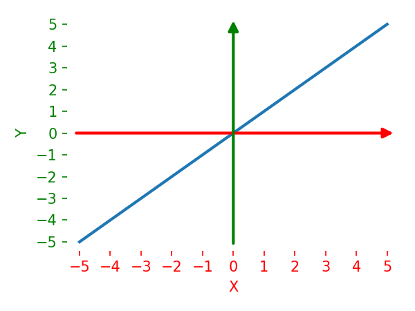
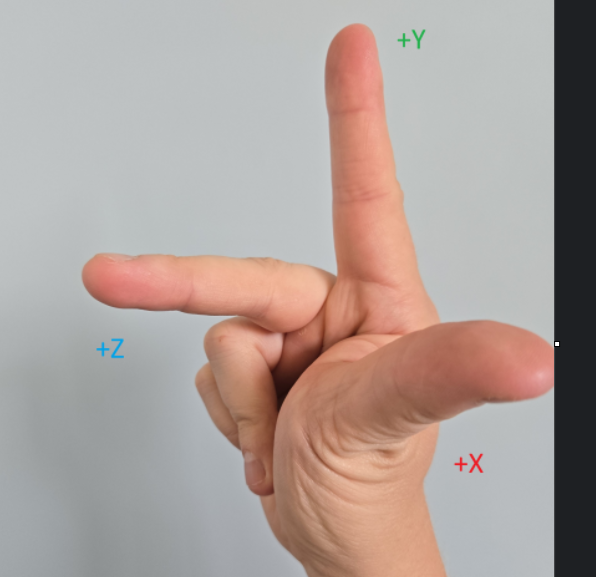
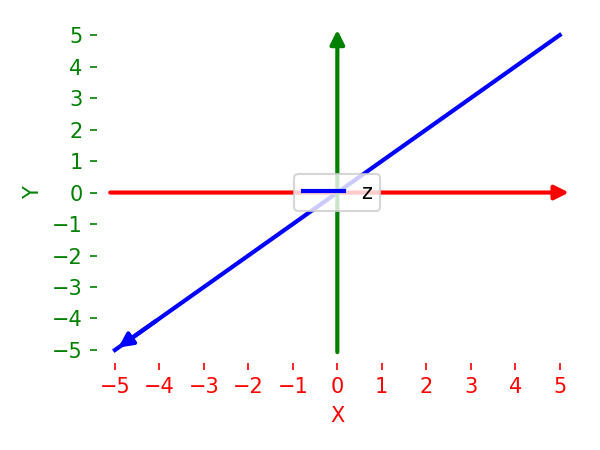
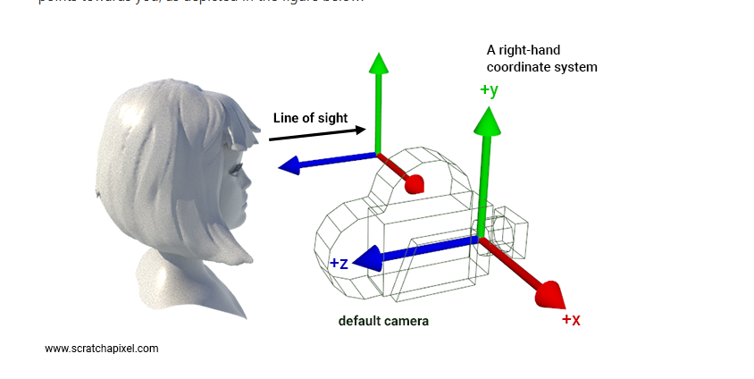
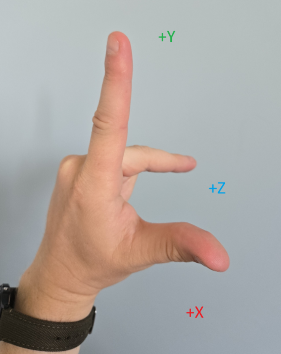
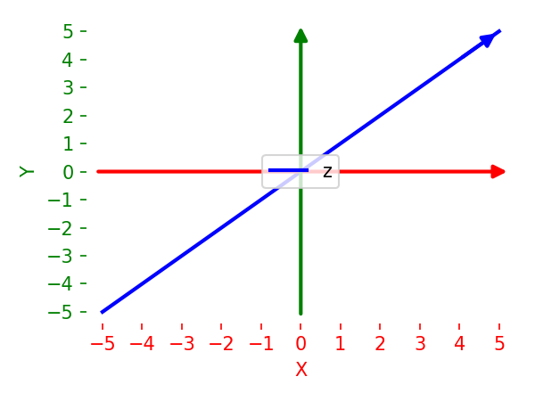
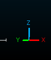

# Coordinate System Handedness

Let's clarify a potential source of confusion. Coordinate system handedness. In my perspective its easiest explained by what direction Z points to relative to x and y. 

# Right Handed Coordinate System

A surprising fact is that the name “right hand coordinate system” comes from the right hand 😮

## Example on with camera perspective

# Left Handed Coordinate System

# Is Y or Z up direction?

This question often sparks debate because **“up”** depends on the application, not the coordinate system’s handedness. Both right-handed and left-handed systems can have **Y-up** or **Z-up** conventions — the difference lies in how the axes are *named and oriented* for the task at hand.

- **Y-Up**
    - Common in many 3D modeling tools (e.g., Maya, OpenGL by default).
    - The ground plane is typically the X–Z plane, and positive Y points upward.
    - Example: In a video game engine with Y-up, jumping increases the Y value.
- **Z-Up**
    - Found in CAD software, Blender (by default), and some GIS/mapping systems. Also CloudCompare
    - The ground plane is the X–Y plane, and positive Z points upward.
    - Example: In a Z-up setup, an aerial drone’s altitude is its Z coordinate.

## Example 1 Left hand coordinate system with CloudCompare where Z is up

# References

[Placing a Camera: the LookAt Function](https://www.scratchapixel.com/lessons/mathematics-physics-for-computer-graphics/lookat-function/framing-lookat-function.html)

https://www.scratchapixel.com/lessons/mathematics-physics-for-computer-graphics/geometry/points-vectors-and-normals.html