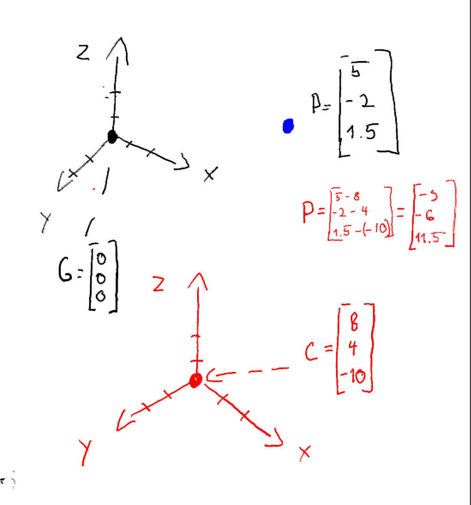
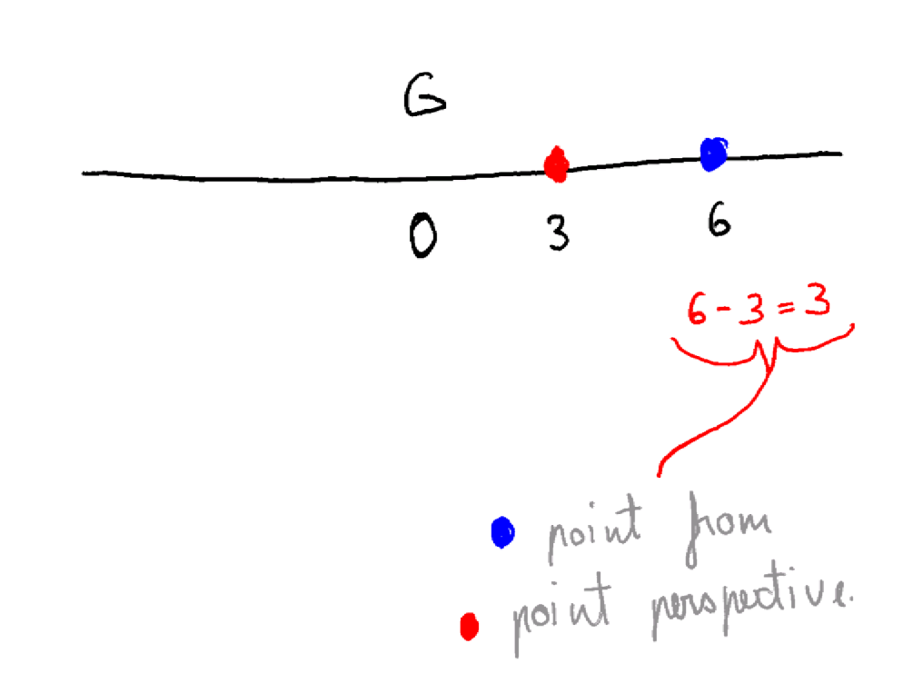

# Point Translation Examples

Here we focus on only translation of point P from global origin G to camera origin G

# 3D TRANSLATION

Hint: think 1 axis dimension at time

- if x coordinate of p is 5 and for c it is 8
    - p in relation to c is 5-8 = -3
- if y coordinate of p is -2 and for c it is 4
    - p in relation to c i -2-4=-6
- if z coordinate —-

# 1D TRANSLATION EXAMPLE

